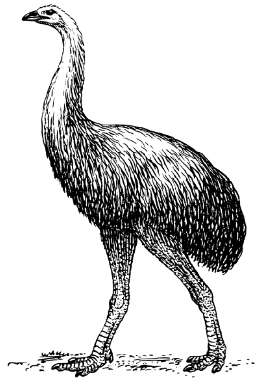

# MultiObjectiveAlgorithms.jl

MultiObjectiveAlgorithms.jl (MOA) is a collection of algorithms for
multi-objective optimization.

## Installation

Install MOA using `Pkg.add`:

```julia
] add MultiObjectiveAlgorithms
```

## Usage with JuMP

**Compat: this requires at least JuMP v1.8.0**

Use `MultiObjectiveAlgorithms` with JuMP as follows:

```julia
using JuMP
import HiGHS, MultiObjectiveAlgorithms
const MOA = MultiObjectiveAlgorithms
model = JuMP.Model(() -> MOA.Optimizer(HiGHS.Optimizer))
set_optimizer_attribute(model, MOA.Algorithm(), MOA.NISE())
set_optimizer_attribute(model, MOA.SolutionLimit(), 4)
```

Replace `HiGHS.Optimizer` with an optimizer capable of solving a
single-objective instance of your optimization problem.

You may set additional optimizer attributes, the supported attributes depend on
the choice of solution algorithm.

## Algorithm

There are a number of algorithms supported by the algorithms in MOA.

 * `MOA.EpsilonConstraint()`
 * `MOA.Hierarchical()`
 * `MOA.Lexicographic()` [default]
 * `MOA.NISE()`

Consult their docstrings for details.

## Other optimizer attributes

There are a number of optimizer attributes supported by the algorithms in MOA.

Each algorithm supports only a subset of the attributes. Consult the algorithm's
docstring for details on which attributes it supports, and how it uses them in
the solution process.

 * `MOA.ObjectiveAbsoluteTolerance(index::Int)`
 * `MOA.ObjectivePriority(index::Int)`
 * `MOA.ObjectiveRelativeTolerance(index::Int)`
 * `MOA.ObjectiveWeight(index::Int)`
 * `MOA.SolutionLimit()`
